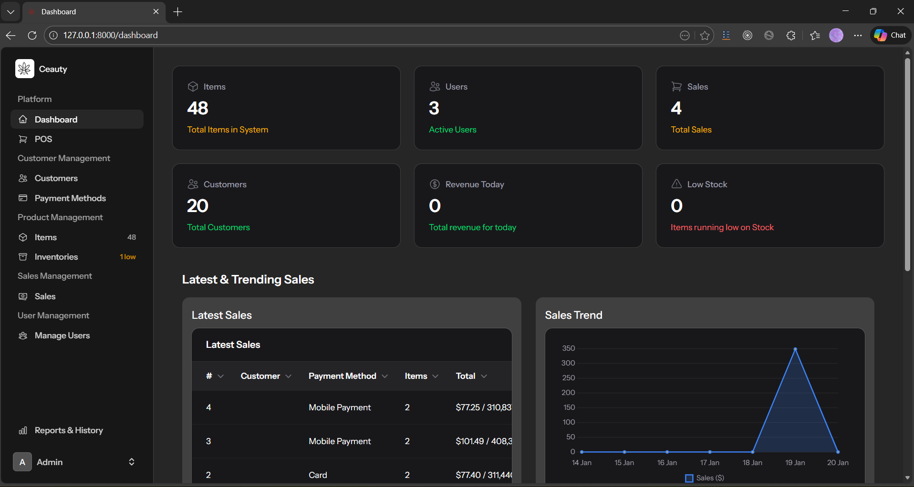
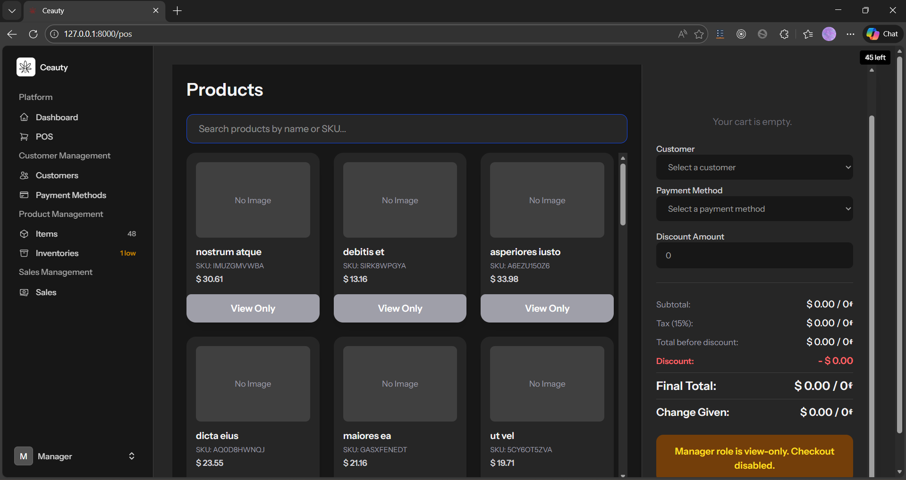
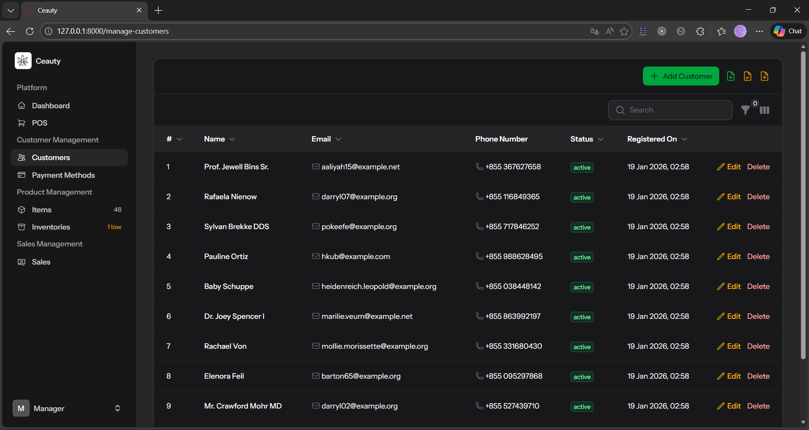
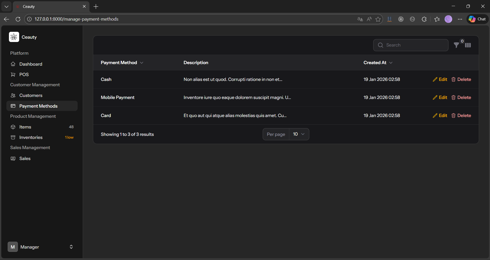
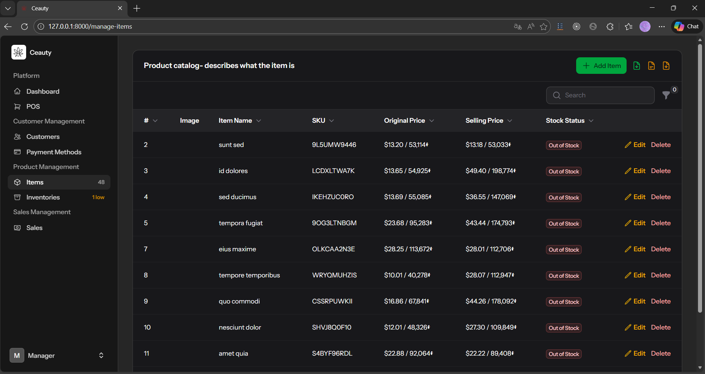
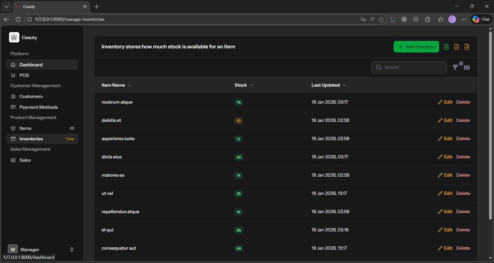
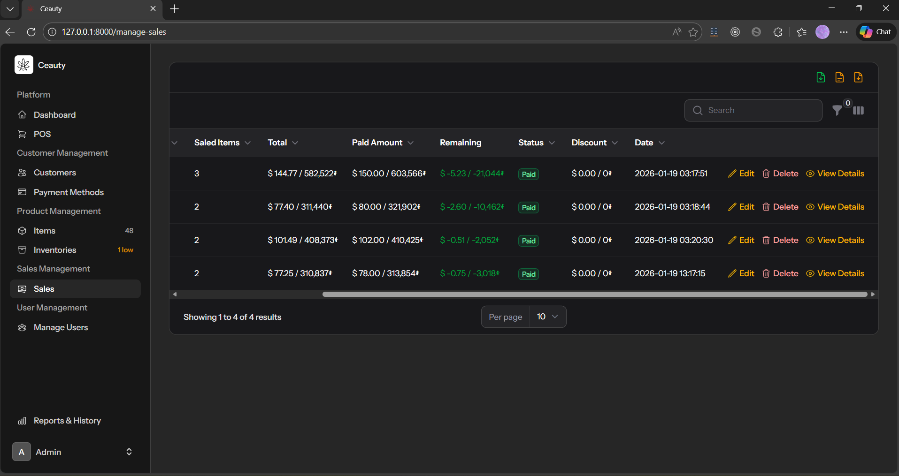

# 🚀 Ceauty - Full Inventory Management System with POS & Admin Dashboard

**Built using Laravel, Herd / XAMPP, and MySQL**

A complete **Inventory Management & Point of Sale (POS) System** built from scratch, including admin features, reports, export tools, role management, and exchange rate support.

---
## 🎥 Video Overview
> 🔗 *[This is the overview of the system](https://youtu.be/88pJusMXQI0)*

---

## ✨ System Features

- **POS (Point of Sale) System**
- **Admin Dashboard**
- **Customer Management**
- **Inventory & Item Management**
- **User Management** (Admin / Manager / Cashier)
- **Payment Methods**
- **Sales & Transaction History**
- **Deleted Records History (Soft Delete)**
- **Exchange Rate Support** (**USD ⇄ KHR Riels**)
- **Export Data** (**Excel, PDF, CSV**)
- **Clean UI & real-world workflow**
- **Custom System Logo: _Ceauty_**

---

## 👥 User Roles

| Role     | Description |
|----------|-------------|
| **Admin**   | Full system access |
| **Manager** | Reports, monitoring, and management |
| **Cashier** | POS and daily sales operations |

---

## 🖥️ System Screenshots

## 🔐 Welcome & Login

## 📊 Dashboard

## 🛒 POS Screen

## 👤 Customer Management

## 💳 Payment Method Management

## 📦 Item Management

## 🏬 Inventory Management

## 📈 Sales & Reports

---

## 🛠️ Tech Stack

- **Backend:** Laravel  
- **Frontend:** Blade, Tailwind CSS  
- **Interactivity:** Livewire  
- **Admin UI:** Filament  
- **Database:** MySQL  
- **Charts:** Chart.js  
- **Exports:** Excel, PDF, CSV  

---

### ⚙️ Installation 

- git clone https://github.com/Sivlin-creater/laravel-pos-admin.git
- cd laravel-pos-admin
- composer install
- cp .env.example .env
- php artisan key:generate
- php artisan migrate
- php artisan serve

---

**Configure your database credentials in .env before running migrations.**
## 🎓 Project Purpose

This system was built for:
- **Educational purposes**
- **Final-year / thesis project**
- **Real-world POS & inventory workflow demonstration**

---

## 👤 Author

**Sivlin Chhay**
Laravel Developer | POS & Inventory Systems

## 📜 License
**This project is intended for educational and learning purposes.**

---

## ✅ Next upgrades (optional ideas)
- **Role permissions matrix**
- **REST API version**
- **Mobile POS version**
